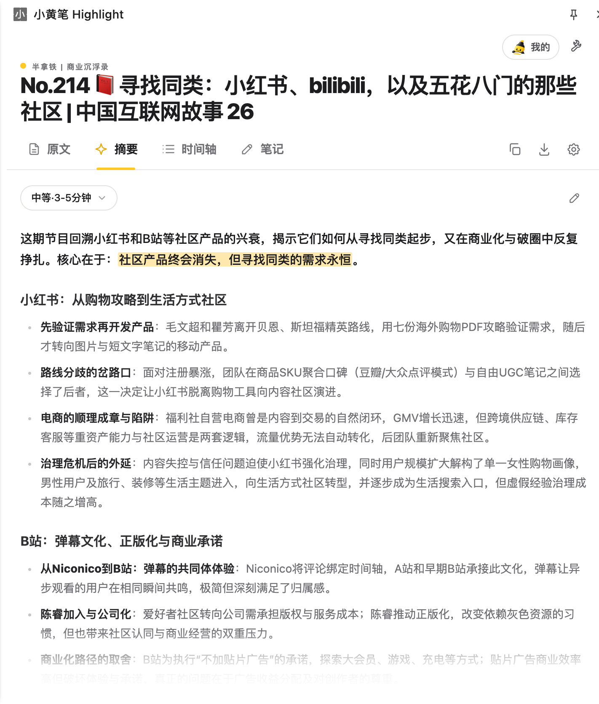
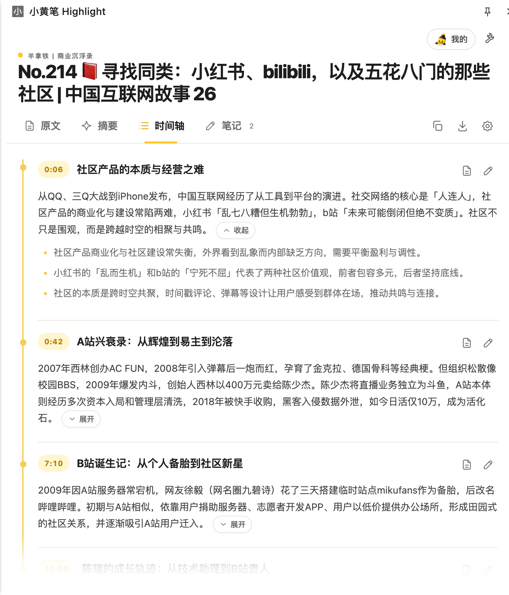
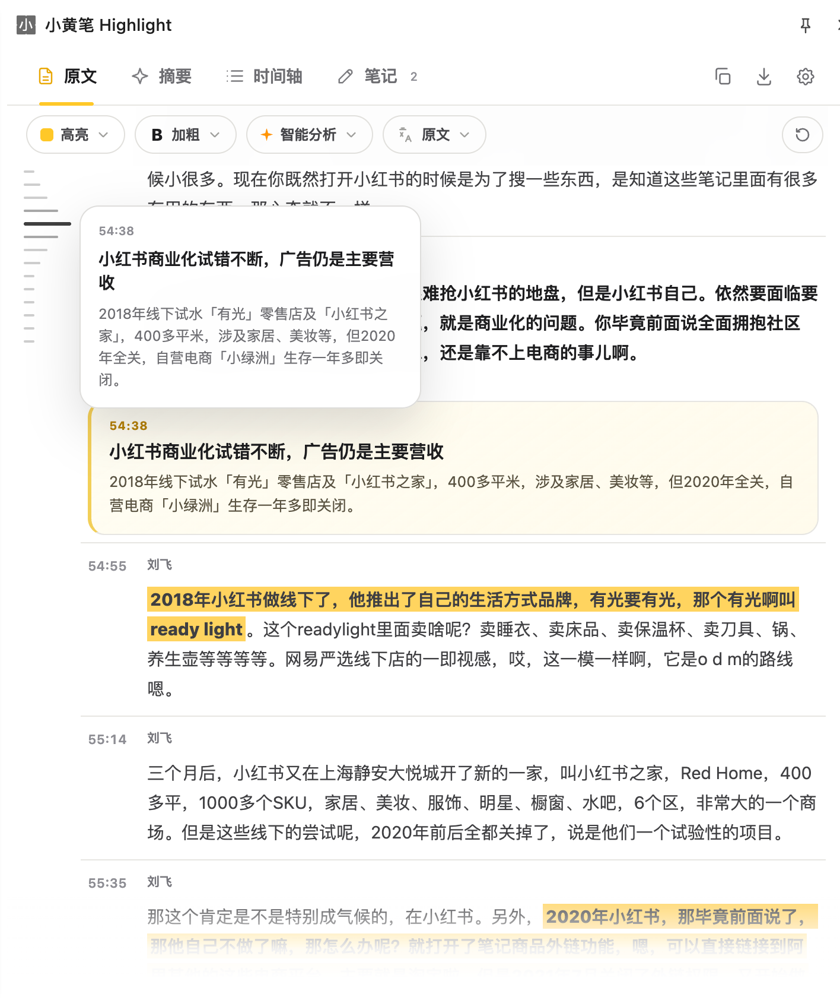
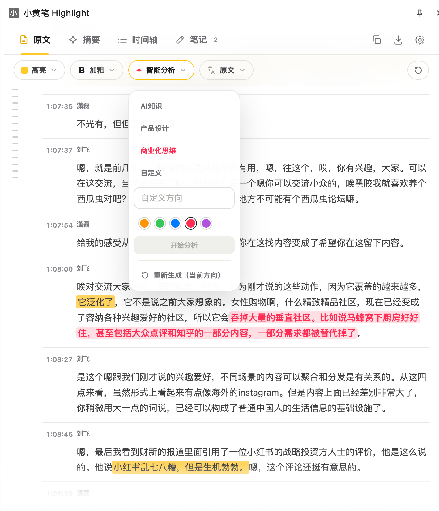
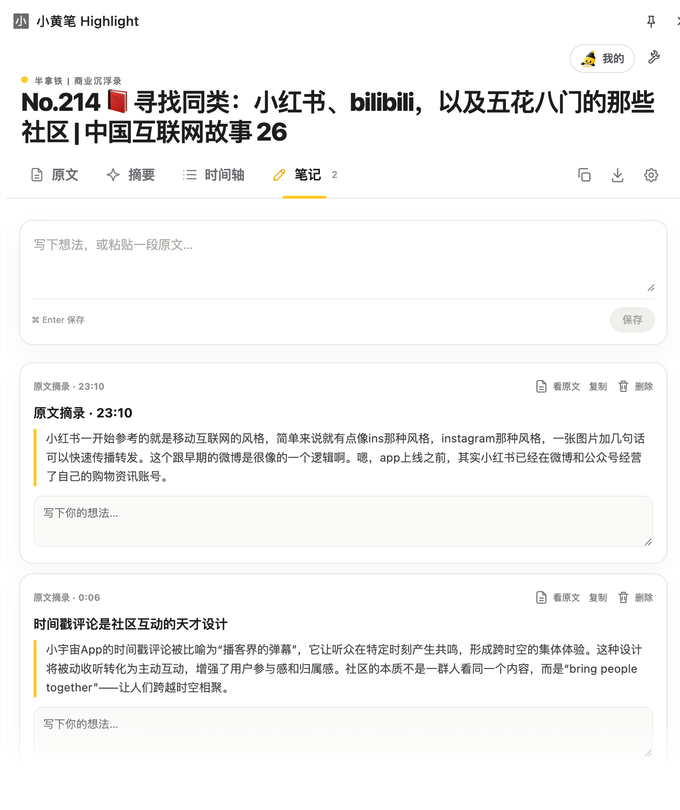
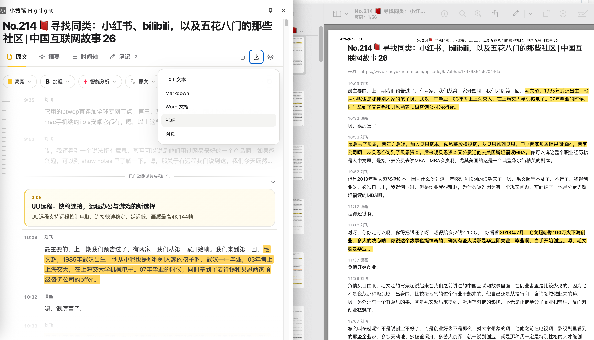
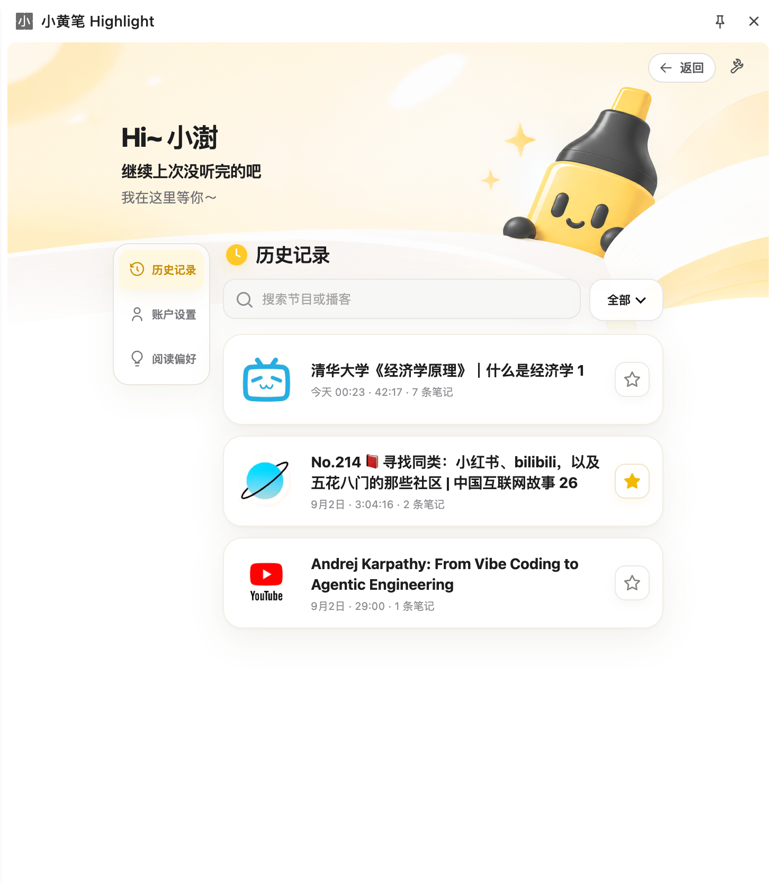

# 小黄笔 Highlight

<p align="center"></p>

## 为什么做这个

一集播客、一场访谈或者一节课程，经常有 1–2 小时。真正想找的内容可能只占几分钟，但从头听到尾很慢；听完以后想找回某句话，又只能重新拖进度条。

直接看 AI 摘要也不完全够用。摘要能帮你快速知道“讲了什么”，但重要的观点、案例和上下文，最后还是要回到原内容里确认。

所以小黄笔做的事情很简单：先把长音视频整理成一份更好读的稿子，再用摘要、时间轴和高亮帮你找到重点；看到感兴趣的地方，可以直接跳回原声继续听。

**长音视频 → 字幕 / 转写 → 字幕修复 → 章节与摘要 → 重点标注 → 原声定位 → 笔记沉淀**

---

## 如何运行

小黄笔目前是一个 **Chrome MV3 扩展**，通过 Chrome 本地加载运行，API Key 由用户自己配置。

### 让 Coding Agent 帮你装

把下面这段直接发给你的 Coding Agent：

> 把这个项目（https://github.com/NBlinxiaoshu/highlight）克隆或下载到我指定的永久文件夹，并带我完成 Chrome「加载已解压的扩展程序」和 API Key 配置。不要替我保存或暴露任何 Key。安装完成后，打开一段 YouTube / Bilibili / 小宇宙内容，确认原文、摘要、时间轴和原声跳转可以正常使用。

### 自己安装

1. 下载仓库并解压到一个固定目录。
2. 打开 `chrome://extensions`，开启「开发者模式」。
3. 点击「加载已解压的扩展程序」，选择包含 `manifest.json` 的项目目录。
4. 在配置页填写所需 API Key。
5. 打开支持的内容页面，点击「小黄笔」或页面右下角的「精读这期」，选择「只读文案」（先判断要不要深入）或「生成完整精读」。

> 本地加载的扩展不会自动更新：换版本或改文件后，需要在 `chrome://extensions` 里点「重新加载」，再刷新页面。

### API Key

| 能力 | 服务 |
|---|---|
| 小宇宙 / 无字幕内容转写 | 阿里云百炼 DashScope |
| YouTube 官方字幕 | [Supadata](https://dash.supadata.ai/) |
| 摘要 / 标注 / 翻译 | [DeepSeek](https://platform.deepseek.com/api_keys)（`deepseek-v4-flash`，非思考模式） |
| Bilibili 官方字幕 | 默认无需 Key；无字幕课程回退到 DashScope 转写 |

具体实现见 [TECHNICAL_DESIGN.md](TECHNICAL_DESIGN.md)。

---

## 核心体验

### 1. 先看懂整期，再决定哪里值得深入

- **摘要**：简短 / 中等 / 详细三档，快速了解整期内容。
- **时间轴**：把长内容拆成章节地图，每章保留摘要与真实时间位置；先建立全局结构，再决定从哪里开始看。

<p align="center"></p>

<p align="center"></p>

### 2. 不只给结论，还能一键回到原声

获取字幕或完成转写后，会先整理断句、补充标点，并修正明显不通顺或识别错误的句子，再生成可连续阅读的稿子。

逐字稿保留**说话人、时间戳与上下文**，点击任意段落即可跳回播放器对应位置；支持「原文 / 中文 / 双语」切换，也会识别片头、广告等低价值内容，并标出金句、数据、方法论和案例。

<p align="center"></p>

### 3. 同一期内容，每个人真正关心的部分并不一样

用户可以设定自己的关注方向，例如 **AI 知识 / 产品设计 / 商业化思维 / 自定义主题**，让 AI 只高亮与当前目标相关的内容。

高亮以候选状态呈现：可以 ✅ 接受、❌ 取消，也可以主动标出自己认为重要的内容。

<p align="center"></p>

### 4. 有价值的内容，最后要能留下来

阅读过程中可以把原文片段一键加入笔记，并保留来源与时间戳；支持导出 TXT / Markdown / Word / 网页 / PDF，方便继续整理到自己的知识库。

<p align="center"></p>

<p align="center"></p>

### 5. 读过的内容可以随时找回来

解析过的内容会保留在历史记录里，可以搜索、按平台筛选和收藏。不同平台的内容放在同一个列表里，之前做过的笔记也能直接看到。

<p align="center"></p>

---

## 三个平台，三种不同的使用方式

| 平台 | 适合场景 | 小黄笔怎么用 |
|---|---|---|
| **小宇宙** | 中文商业 / 创投 / 产品播客 | 先读摘要和时间轴，快速抓行业动态、观点和案例，再回听真正重要的部分。 |
| **YouTube** | AI / 科技长视频、英文演讲、访谈 | 读取官方字幕，生成可检索的双语阅读稿；适合追英文原声，又不想被听力速度限制。 |
| **Bilibili** | 中文知识区 / 课程 / 教程 | 把字幕整理成接近讲义的阅读体验，用章节和时间轴快速定位知识点，需要时再跳回老师原讲解。 |

---

## 它是怎么工作的

```text
YouTube / Bilibili / 小宇宙
          ↓
获取官方字幕 / 音频转写
          ↓
字幕修复
断句 · 补标点 · 修正明显识别错误 · 说话人整理
          ↓
过滤片头、广告等低价值内容
          ↓
生成章节 / 摘要 / 重点标注
          ↓
原文阅读 / 时间轴 / 原声跳转 / 笔记 / 导出
```

不同平台拿到原始内容的方式不一样：

- **小宇宙**：没有现成字幕时，用百炼 Qwen Audio 转写音频；
- **YouTube**：读取官方字幕（Supadata `mode=native`，不做 AI 生成转写兜底）；
- **Bilibili**：优先读取官方字幕，没有字幕时再做音频转写。

拿到字幕后，先把机器字幕里常见的断句、标点和明显识别问题整理好，再继续做章节、摘要和重点标注。这样后面的阅读体验不会建立在一份很难读的原始字幕上。

---

## 技术实现

- **Chrome Extension**：MV3 + Side Panel API
- **Frontend**：原生 HTML / CSS / JavaScript
- **Backend**：Node.js + SQLite
- **LLM**：DeepSeek
- **ASR**：DashScope / Qwen Audio
- **YouTube Transcript**：Supadata
- **Architecture**：平台接入 + 内容处理 Pipeline + 本地优先存储

仓库内置可独立部署后端，用于 ASR 任务、账号与跨设备资料库；云端同步默认关闭，不内置任何 Key。Key 与摘要保存在 Chrome 本地，完整逐字稿只在侧边栏内存里，不做持久化。

说话人识别只在能确认时给出姓名，否则显示「说话人 N」；摘要按档位控制篇幅，标注的文字必须在原稿里能原样匹配，章节时间戳会对齐到真实段落起点。

```bash
npm test      # 65 项（platform + core）
npm run check # 全量语法检查
```

详细设计见：

- [TECHNICAL_DESIGN.md](TECHNICAL_DESIGN.md)
- [PLATFORM_ROADMAP.md](PLATFORM_ROADMAP.md)
- [server/README.md](server/README.md)
- [PRIVACY.md](PRIVACY.md)

---

## 下一步

现在的小黄笔主要解决的是：**当你已经找到一段想看的内容，怎么更快读完、找到重点并留下笔记。**

后面我想继续补两块。

### 1. 自动跟进固定的信息源

现在还需要用户自己打开博客、频道或播客，再把内容交给小黄笔处理。

后续希望支持直接 Follow 指定的信息源。新内容发布后，自动完成解析并生成阅读页面；也可以设置固定时间提醒，比如每天早上 8:00 把昨天新出的内容集中放进日程里。

这样日常获取信息时，可以少做一遍“去各个平台检查有没有更新”的重复操作。

### 2. 用真实标注结果调整高亮

现在 AI 高亮可以 ✅ 保留、❌ 取消，用户也可以自己补充高亮。

这些操作本身就是很直接的反馈：哪些内容经常被留下，哪些经常被删掉，哪些内容是用户主动标出来的。后续会把这些记录用于调整高亮，让下一次的结果更贴近实际阅读习惯，而不是每次都重新设置一遍偏好。

### 还想继续做的

- 跨多期内容搜索与问答
- 同主题多期内容对比
- 自动整理书单、工具清单
- 导出到 Notion / Anki
- 英文内容的跟读与学习模式
